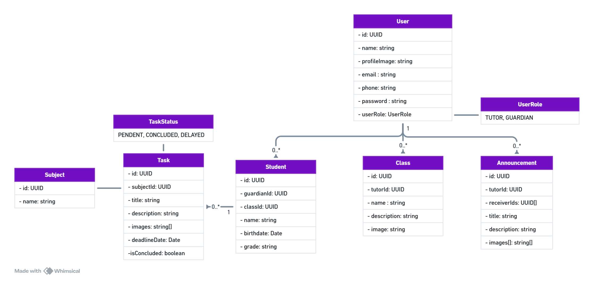

Tarefando API
=============

A REST API for a mobile app designed to track and manage school tasks for primary and tutoring education students, intended for parents/guardians and tutors.

---
## Class diagram

---

## Documentation
Swagger UI: https://tarefando-api.onrender.com/swagger-ui/index.html

## License

This project is licensed under the terms of the **MIT** license.
