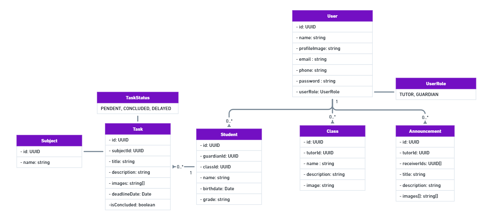

Tarefando API 
=============

A REST API for a mobile app designed to track and manage school tasks for primary and tutoring education students, intended for parents/guardians and tutors use.

---
## Class diagram ✒️

The following diagram was used as representation of the structure and relationships between key entities, serving as the foundation for the API design.

---

## Documentation 📖
Swagger UI: https://tarefando-api.onrender.com/swagger-ui/index.html

## License 📃

This project is licensed under the terms of the **MIT** license.
